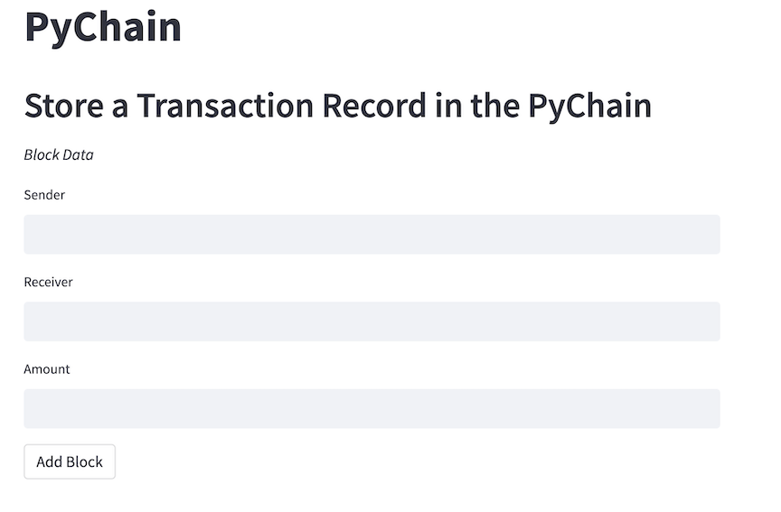
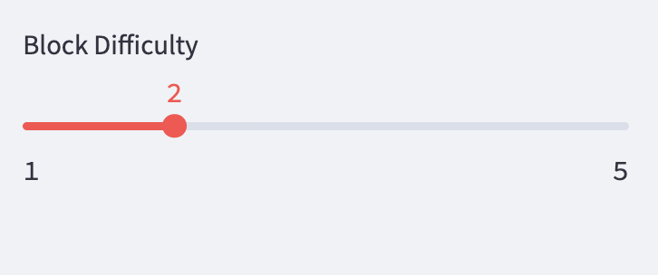
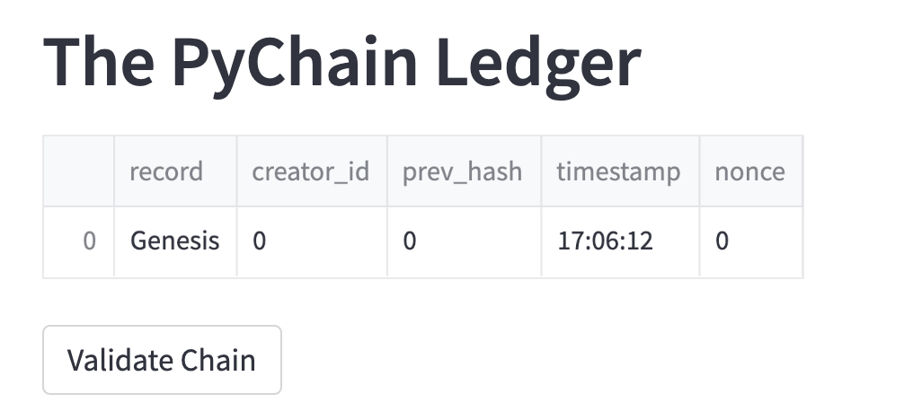

# PyChain
This project showcases basic blockchain code and its user interface within a Streamlit app.  The user can input a transaction record identifying sender, receiver and financial amount to be included in a block. The block is encoded and added to the blockchain.  The chain can be verified and any previous blocks reviewed in dropdown menu bar.

---

## Technologies

Python implementation: CPython

Python version       : 3.7.13

IPython version      : 7.31.1

Streamlit version    : 1.17.0

---

## Packages & Libraries

import streamlit as st

from dataclasses import dataclass

from typing import Any, List

import datetime as datetime

import pandas as pd

import hashlib

---

## Part 1: Streamlit app setup

1. activate your development environment
    - `conda activate dev`

2. `pip install streamlit`
    - install streamlit to your dev env
    - web app interface library

3. `pip install hashlib`
    - install hashlib to dev env
    - hash encoding library

4. In terminal, move to directory where repository is filed, run `pychain.py`
    -`streamlit run pychain.py`
    
---

## Part 2: Streamlit Interface 

1. Add data to the user input areas for sender, receiver, and amount

2. Press the "Add Block" button to see your record written to a block and added to the ledger below

3. *On the left sidebar of the screen* Move the "Block Difficulty" slider bar,to make it easier or more difficult for the block to be added

4. Press "Validate Chain" button to see whether or not the entire chain can be validated as unaltered

5. *On the left sidebar of the screen* choose from the dropdown menu which block you would like to see details about

***examples shown are fictious*** 

---

## Part 3: Python Code

1. `Record` dataclass is created to contain the attributes: sender, receiver and amount which is collected from the user on the Streamlit interface

2. `Block` dataclass is created to contain the Record class as an attribute along with the creator id, previous hash, timestamp, and nonce
    - the `hash_block` method is in this class: once called, the method creates a hash of the attribute data using sha256, and returns the hexidigest string
    
3. `PyChain` dataclass is created to takes the `Block` class data and adds it the the `chain` attribute as a list, along with the starting `difficulty` value used in the `proof_of_work` method
    - the `proof_of_work` method is in this class: once called, the method pulls in the hexidigest string from the `hash_block` method listed above and runs a while loop looking for the hash matching the block with the right difficulty level (== the number of '0' at the beginning of the hash), and returns the block data
    - the `add_block` method, calls the proof of work, and adds the block data to the chain
    - the `is_valid` method, checks that the hash of the previous block matches the hash in the current block and returns a True value if verified

4. The `set_up` function is run to initialize the first block in the blockchain

4. Streamlit Interface code
    - utilizes the cashe decorator to hold the previous data in memory and save on computational time
    - uses markdown text and write functions to comminicate headers and instructions to users
    - uses text boxes, sidebar slider, and buttons to take in user data and execute methods within classes

---

## Part 4: Watch a Demo

[Streamlit_Blockchain_Demo](streamlit_blockchain_demo)

---

## Contributors

This project was in conjunction with UC Berkeley staff and myself Jodi Artman.  *artman.jodi@gmail.com*

---

## License

licensed in accordance with UC Berkeley policy
